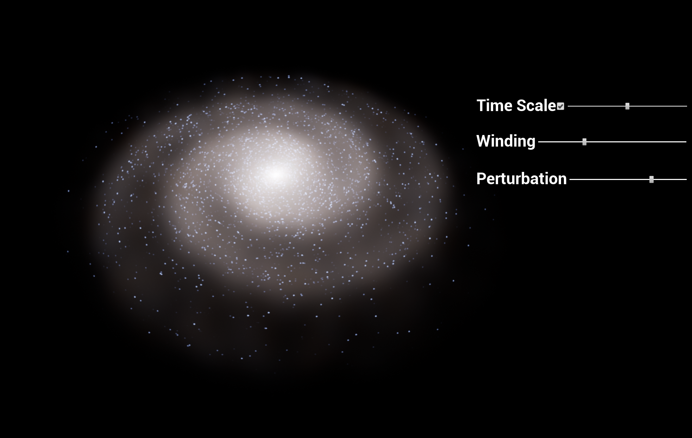

# Galaxy structure exploration project

A project to learn about galaxy structure models and experiment with various Unreal Engine features and techniques.

# ThirdParty libraries

The _Source/ThirdParty/_ files provide the OpenVDB library for the project.

There is already a "OpenVDB" module built into Unreal Engine by the experimental ProxyLOD plugin, but it has a bunch of things stripped out which are needed for this project, so cannot be used directly.

The OpenVDB library here is built outside the engine, so it requires a few more tricks. The solution file _openvdb/OpenVDB/OpenVDB.sln_ can be used to rebuild the library itself if needed:
It defines a few macros for external dependencies which may need adjustment:
* Either edit the _openvdb\OpenVDB\OpenVDB\ThirdParty.props_ file directly
* Or edit the properties in Visual Studio:
  - _View > Other Windows > Property Manager_
  - expand _OpenVDB > Debug|Win32_ (any target will do)
  - right click on _ThirdParty > Properties > Common Properties > User Macros_

Adjust the paths according to your setup.

A workaround is needed for inconsistent OpenEXR include paths: OpenVDB tries to include half.h as `#include <OpenEXR/half.h>`, but the openexr folder structure in UE4 ThirdParty does not match this pattern. To fix this a symbolic link in the project's own _Source/ThirdParty_ folder should be created with the name _OpenEXR_ which points at the include directory containing `half.h`. For example:

    mklink /D OpenEXR "C:\Program Files\Epic Games\UE_4.26\Engine\Source\ThirdParty\openexr\Deploy\OpenEXR-2.3.0\OpenEXR\include"

Symbolic links can not be stored in git, so this has to be done locally.
